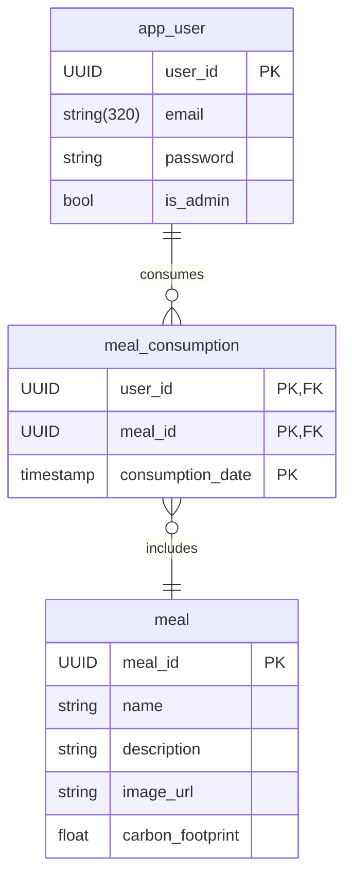

# Web project IG3 - Backend

This is an application that allows users to calculate the carbon footprint of their food consumption. The front-end is a web application that allows users to enter their daily food consumption and get the carbon footprint of their consumption.
The back-end is a REST API that allows the front-end to communicate with the database.

## Table of Contents

- [Requirements](#requirements)
- [Database](#database)
- [Installation](#installation)

## Requirements

**Functionnal requirements**
- User registration and authentication: Users should be able to create an account and log in to access the web app's features.
- Food diary: Users should be able to add their daily food consumption to the app by choosing from a list of meals.
- Trends and analytics: Users should be able to view their historical carbon footprint data, as well as identify trends and areas for improvement.

Optional features:
- Trends and analytics about the type of food eaten, not only the carbon footprint.
- Quick carbon footprint calculation: Users without accounts should be able to quickly calculate their annual food carbon footprint by entering their food consumption data.

**Non-functionnal requirements**
- Responsiveness: The web app should be responsive and work on all devices.
- Security: The web app should be secure and protect users' data (pay attention to the OWASP Top 10 - https://cheatsheetseries.owasp.org/cheatsheets/Nodejs_Security_Cheat_Sheet.html).
- Ergonomics and performances : The user must be able to add its daily food consumption quickly (no more than 20 seconds).
- REST API: The back-end should be a REST API, ideally using the HATEOAS principle (Richardson Maturity Model Level 3).

## Database

## Installation
1. Clone the repository
2. Install the dependencies with `npm install`
3. If the server is running in production, set the environment variable `NODE_ENV` to `production`. If not, create a `.env` file in the root directory and set the environment variables `PORT` and `DATABASE_URL` to the port and database URL respectively.
4. Run the server with `npm run dev` in a development environment or `npm run start` in a production environment.